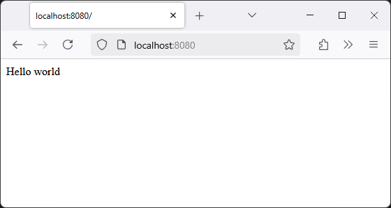
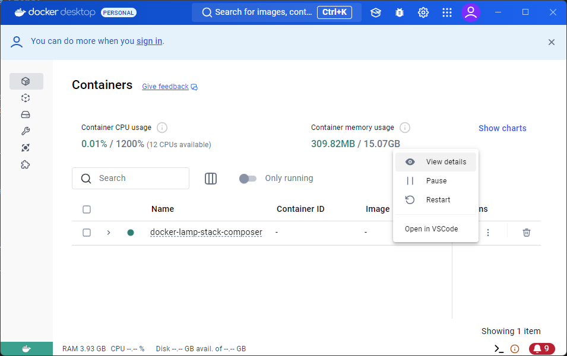
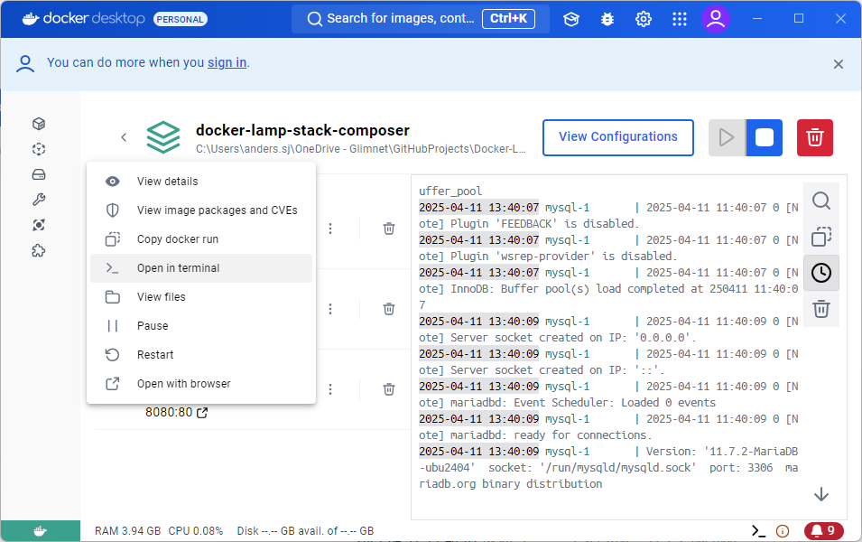
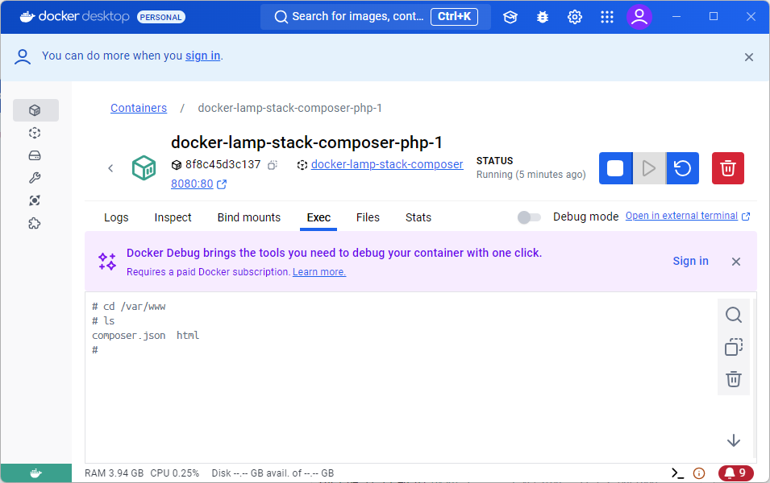
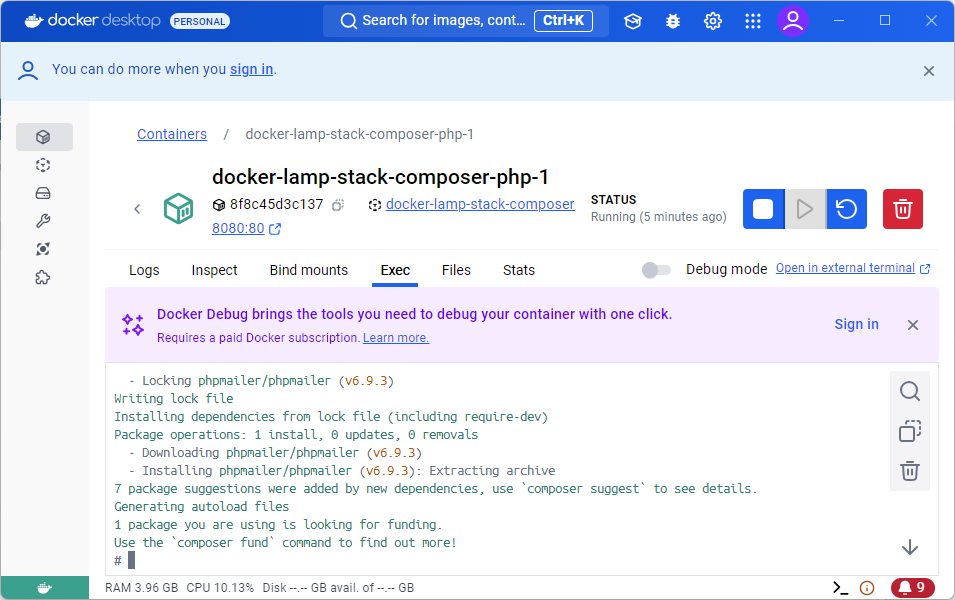
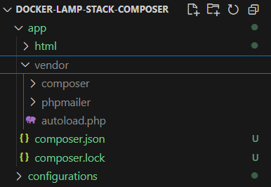
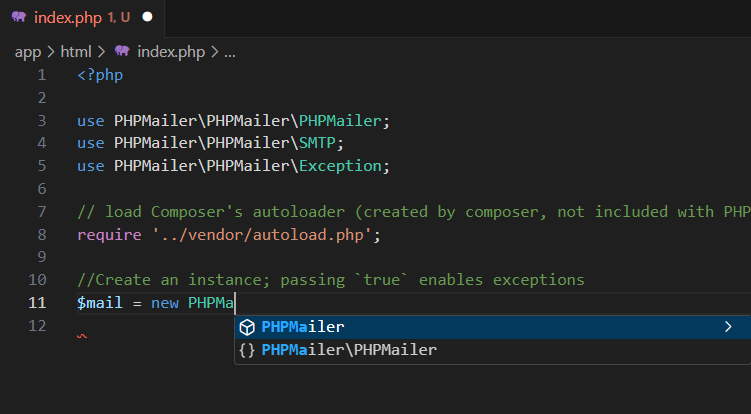

# Docker-LAMP-stack-composer

Template to build a php application. Steps below using editor like Visual Studio Code.

### Requirements:

Docker Desktop installed and running
https://www.docker.com/products/docker-desktop/

### Steps:

1. Clone repository
2. Open terminal, navigate to current folder
3. Run cmd `docker-compose up`

When application is installed open a browser and visit
http://localhost:8080

You should see a simple "Hello world" response in browser. 

### Use composer

In Docker Desktop open current container.

Open terminal for service running *php* (port 8080). 

Navigate to folder `/var/www`. Yuo should see the local file *composer.json* inside the container.  

Run command `composer install`. 

The command will create a folder named vendor, and content i composer.json. A folder you now should se locally browsing /app/.

PHPMailer - Intellisense 

---
